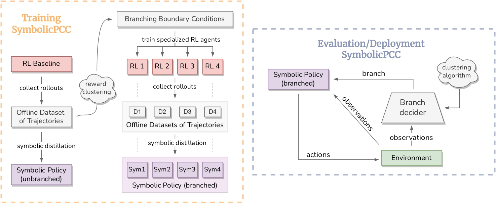
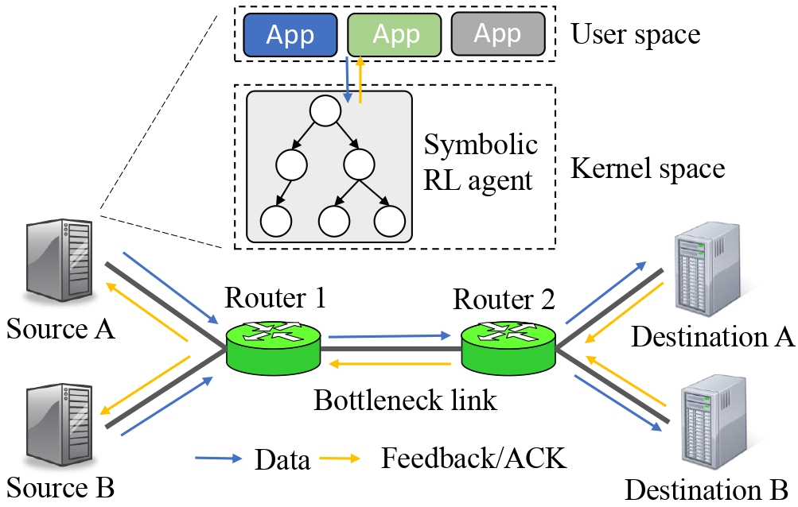
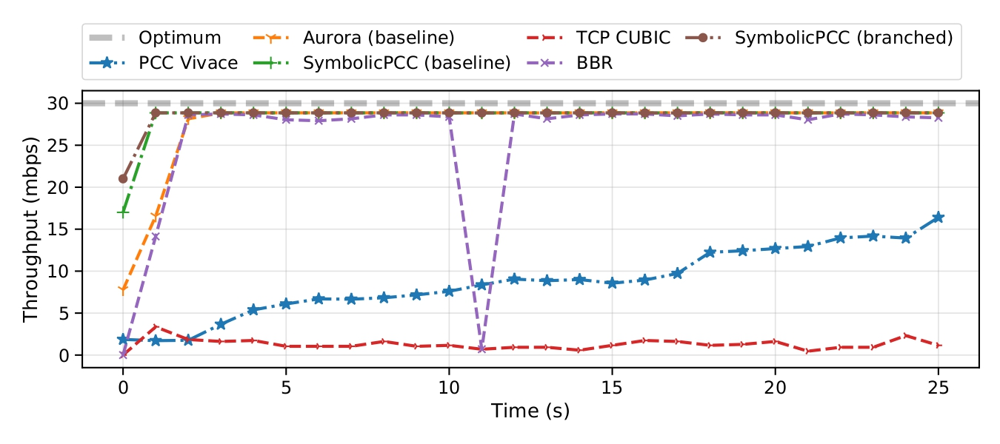
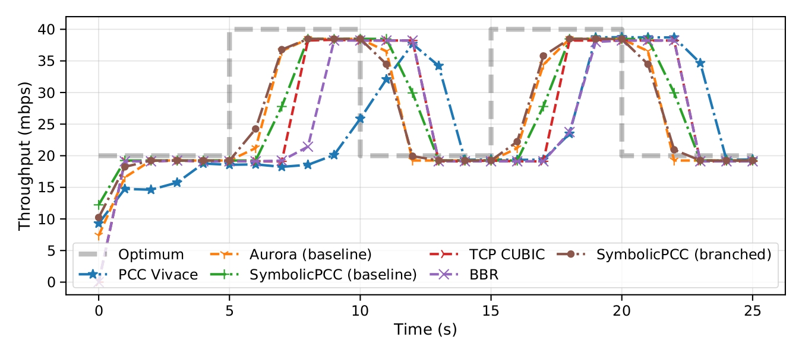
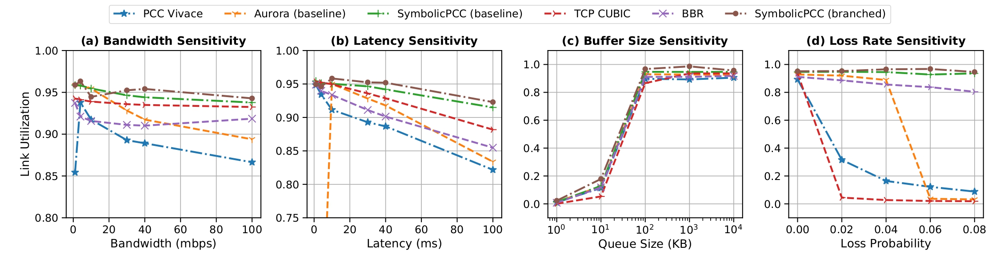

<div align="center">

# Symbolic Distillation for Learned TCP Congestion Control

**Accepted at [NeurIPS 2022](https://neurips.cc/virtual/2022/poster/54408)**

| **[ [```Paper```](https://openreview.net/pdf?id=rDT-n9xysO) ]** | **[ [```Poster```](https://neurips.cc/virtual/2022/poster/54408) ]**
|:-------------------:|:-------------------:|



</div>

---

## Introduction

Recent advances in TCP congestion control (CC) have achieved tremendous success with deep reinforcement learning (RL) approaches, which use feedforward neural networks (NN) to learn complex environment conditions and make better decisions. However, such "black-box" policies lack interpretability and reliability, and often, they need to operate outside the traditional TCP datapath due to the use of complex NNs. This paper proposes a novel two-stage solution to achieve the best of both worlds: first to train a deep RL agent, then distill its over-parameterized NN policy into white-box, light-weight rules in the form of _symbolic_ expressions that are much easier to understand and to implement in constrained environments. At the core of our proposal is a novel **symbolic branching** algorithm that enables the rule to be aware of the context in terms of various network conditions, eventually converting the NN policy into a symbolic tree. The distilled symbolic rules preserve and often improve performance over state-of-the-art NN policies while being faster and simpler than a standard neural network. We validate the performance of our distilled symbolic rules on both simulation and emulation environments. 

<div align="center">
    <table>
        <tr>
            <td>
                
            </td>
        </tr>
        <tr>
            <th>Overview of a congestion control agent's role in the network<th>
        </tr>
    </table>
</div>


## Results

<div align="center">
    <table>
        <tr>
            <td>
                
            </td>
        </tr>
        <tr>
            <th>Emulation Performance on Lossy Network Conditions<th>
        </tr>
    </table>
    <br>
    <table>
        <tr>
            <td>
                
            </td>
        </tr>
        <tr>
            <th>Emulation Performance under Network Dynamics<th>
        </tr>
    </table>
    <br>
    <table>
        <tr>
            <td>
                
            </td>
        </tr>
        <tr>
            <th>Link Utilization and Network Sensitivities<th>
        </tr>
    </table>
</div>

## Citation

If you find our code implementation helpful for your own resarch or work, please cite our paper.

```bibtex
@inproceedings{
    sharan2022symbolic,
    title={Symbolic Distillation for Learned {TCP} Congestion Control},
    author={S P Sharan and Wenqing Zheng and Kuo-Feng Hsu and Jiarong Xing and Ang Chen and Zhangyang Wang},
    booktitle={Thirty-Sixth Conference on Neural Information Processing Systems},
    year={2022},
    url={https://openreview.net/forum?id=rDT-n9xysO}
}
```

# Contact

For any queries, please [raise an issue](https://github.com/VITA-Group/SymbolicPCC/issues/new) or contact [S P Sharan](mailto:spsharan@utexas.edu).

# License

This project is open sourced under [MIT License](LICENSE).
